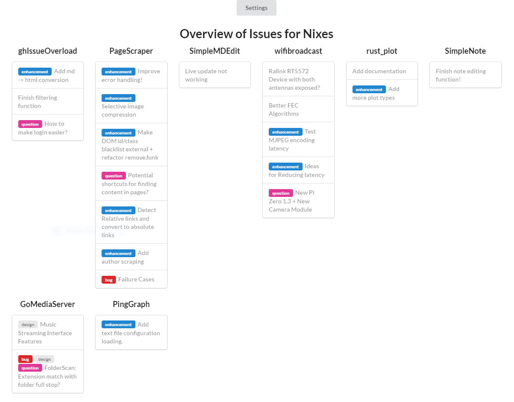

# Github Issue Overload
A web app to give an overview of all issues associated with a github account in a single page

[Live Demo](https://nixes.github.io/ghIssueOverload/)

Requires github login as it uses the github api directly with no intermediary servers

## Features and filtering

  - Show only; subscribed, assigned, mentioned or created
  - Show those with a specific label; bug, enhancement or question
  - Limit number of issues shown per repo.

